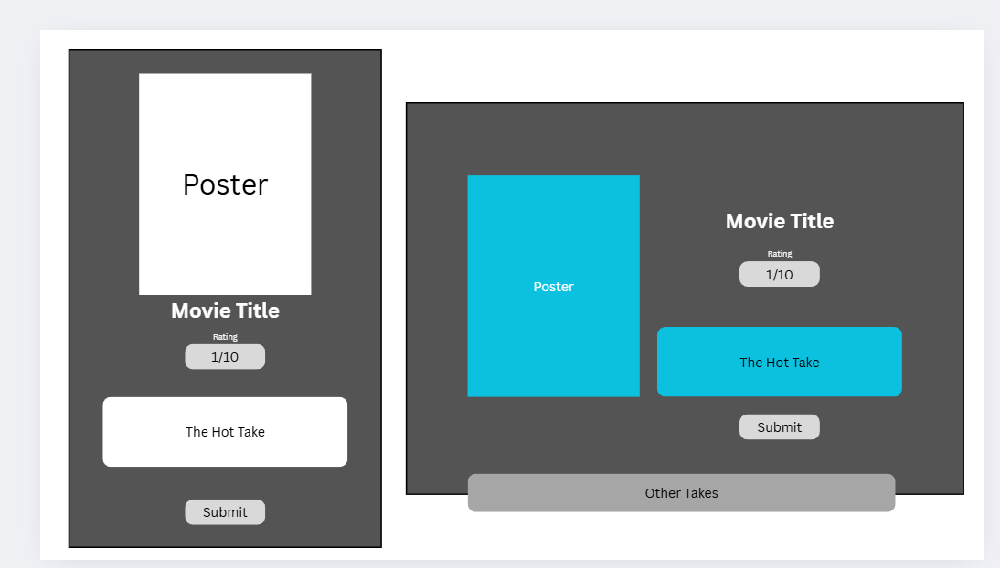
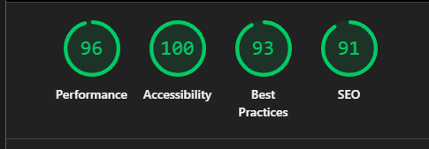

# Project Plan:

## Hot Takes Only: Where Movie Opinions Go Nuclear!

### Project Documentation

Render link: https://hot-takes-vr6i.onrender.com/
Repo link: https://github.com/Sparkes7/Hot-Takes-Only
Server link: https://hot-takes-only.onrender.com/

##### Team members:

Gabby, Will, Dan

##### Project description:

An app that gives the user a random popular movie to provide a vibe-based review, focusing on providing amusing "hot takes" and sharing these with other users.

##### Problem domain:

People have historically been forced to produce grandiose and arduous movie reviews on platforms such as Letterboxd. We present an easy, relaxed, and playful way to review movies in a very non-committal manner.

##### User stories:

- I want to see a random movie when I open the website
- I want to assign an emoji based on feeling, to go with the Hot Take
- I want the website to feature some animation for visual feedback
- I want to be able to access the website on my mobile device and have
  a good experience on different devices
- I want a tasteful jingle to sound when I press the submit button
- I want to see other Hot Takes after I've submitted my own

##### Stretch goals:

- I want a button to view the movie's trailer
- Have the movie displayed come from a curated list of popular movies

##### Wireframe: 

##### Frameworks used:

Express.js
Cors
Dotenv
PG
Vite.js

#### Instructions on how to run your app:

Click the link, select an emoji, enter your Hot Take, and submit!
https://hot-takes-vr6i.onrender.com/

#### Lighthouse report:

##### Reflections:

Please mention the requirements you met and which goals you achieved for this assignment.

##### 🎯 Were there any requirements or goals that you were not quite able to achieve?

We were not able to add as much animation as we hoped. We planned to animate the displaying of the hot takes when submitting, so they appeared with flair, rather than just popping into existence.
The initial solutions did not seem to work for our case, and we did not have as much time as we would have needed to experiment with keyframe animations.

##### 🎯 If so, could you please tell us what was it that you found difficult about these tasks?

We wanted to add the animation on displaying the "Hot Takes" section beneath the user form entries. This meant adding Javascript as well as CSS and we didn't have enough time to play around with this.

What went really well and what could have gone better?

The entire project went really well. We planned this very well, and once the backend was sorted, it did not need to be changed. Often, we preempted issues and solved them before they became larger issues, which really streamlined the app-building process.

Our version control was efficient. We avoided major issues, and minor merge conflicts were easily resolved. Moving forwards, we would consider disabling automatic formatting, as there were several instances of dozens of lines being rearranged or deleted/added, but the content remaining the same.

The main obstacle was getting the 'Hot Take' from the database to match the movie displayed on screen. The workaround for this was to pull all reviews from the database and filter to the movie ID. It would be more efficient to do the filtering in the query, rather than pulling all and filtering afterwards.

Getting the selected emoji to remain visibly selected caused a problem for a little while. The fix was rearranging the input and label to have the input "above" the label, as the CSS pseudo class "checked" applies to the next label in the HTML, which was trying to link radio boxes and labels with different names.
https://developer.mozilla.org/en-US/docs/Web/CSS/:checked

We faced some difficulties using the API to get only trailers and not clips; TMDb API contains several videos for most movie IDs, so we needed some logic to check the video name contained "Trailer".

##### References:

https://www.themoviedb.org/?language=en-GB
https://stock.adobe.com/uk/search?k=fire+png&asset_id=627393178
https://pixabay.com/sound-effects/tinkle4-93228/
https://developers.google.com/youtube/iframe_api_reference
